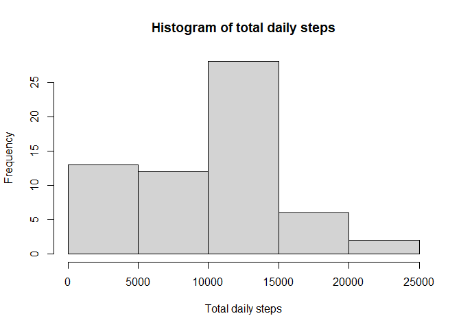
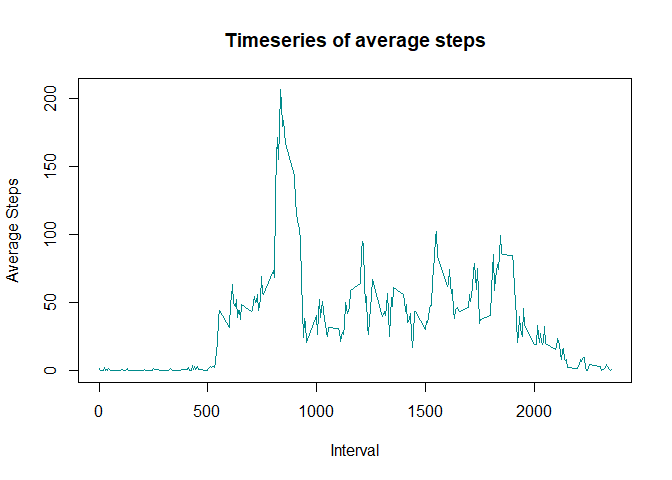
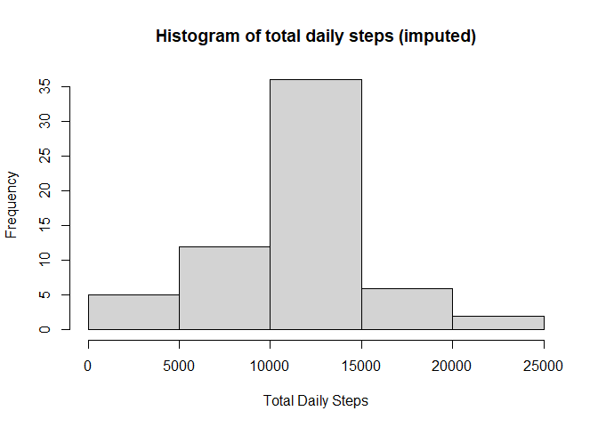
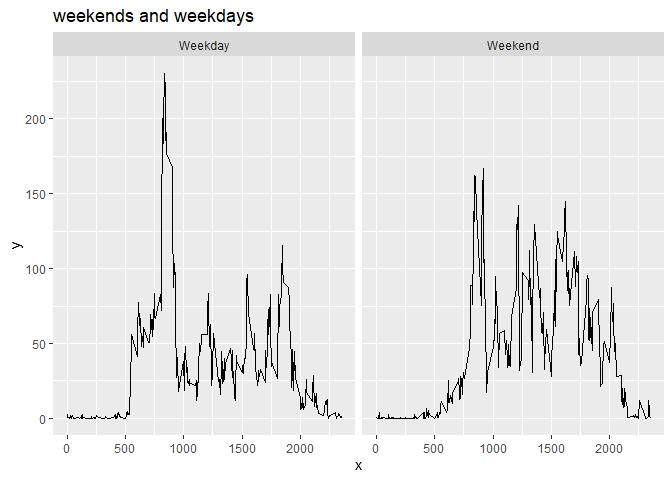

## Loading and preprocessing the data

```r
url <- "https://d396qusza40orc.cloudfront.net/repdata%2Fdata%2Factivity.zip"
path <- "C:/Users/jesse/Desktop/R/RepData_PeerAssessment1/data.zip"
download.file(url,path)
unzip(path)
data <- read.csv("activity.csv")
data$date <- as.Date(data$date, "%Y-%m-%d")
```


## What is mean total number of steps taken per day?
The mean total number of steps taken per day is 9354.23 steps.

```r
library(dplyr)
```

```
## 
## Attaching package: 'dplyr'
```

```
## The following objects are masked from 'package:stats':
## 
##     filter, lag
```

```
## The following objects are masked from 'package:base':
## 
##     intersect, setdiff, setequal, union
```

```r
data <- as_tibble(data)

byday <- data %>%
  group_by(date) %>%
  summarize("sum" = sum(steps, na.rm =TRUE))
```

```
## `summarise()` ungrouping output (override with `.groups` argument)
```

```r
hist(byday$sum, main = "Histogram of total daily steps", xlab = "Total daily steps")
```

<!-- -->

```r
median(byday$sum)
```

```
## [1] 10395
```

```r
mean(byday$sum)
```

```
## [1] 9354.23
```

## What is the average daily activity pattern?
The average daily pattern shows very low steps between 0 and the 500th interval then a rise to around 50 steps per interval with a maximum of 206 steps at the 835th interval. After this peak, steps hover between 50 and 100 sets per interval until they decline around 1900. 

```r
averageday <- data %>%
  group_by(interval) %>%
  summarize("average" = mean(steps, na.rm = TRUE))
```

```
## `summarise()` ungrouping output (override with `.groups` argument)
```

```r
plot(averageday$interval, averageday$average, type = "l", main = "Timeseries of average steps",
     col = "cyan4", ylab = "Average Steps", xlab = "Interval")
```

<!-- -->

```r
maxinterval <- subset(averageday, averageday$average == max(averageday$average))
maxinterval
```

```
## # A tibble: 1 x 2
##   interval average
##      <int>   <dbl>
## 1      835    206.
```

## Imputing missing values
Here I impute the missing values using the average steps for each interval.


```r
  ##check how many there are
  sum(is.na(data$steps))
```

```
## [1] 2304
```

```r
  ##join averages for each interval to the main data
  data2<- left_join(data, averageday)
```

```
## Joining, by = "interval"
```

```r
  ## create an impute column, where, if steps is NA it replaces the NA value 
  ## with the average for that interval
    data$impute <- ifelse(is.na(data2$steps), data2$average, data2$steps)
    data3 <- select(data,impute,date,interval)
    data3<-rename(data3, steps = impute)
```
##Redo of daily steps histogram using imputed data

```r
 byday2 <- data3 %>%
    group_by(date) %>%
    summarize("sum" = sum(steps))
```

```
## `summarise()` ungrouping output (override with `.groups` argument)
```

```r
  hist(byday2$sum, main = "Histogram of total daily steps (imputed)", xlab = "Total Daily Steps")
```

<!-- -->

```r
median(data3$sum)
```

```
## Warning: Unknown or uninitialised column: `sum`.
```

```
## NULL
```

```r
mean(data3$sum) 
```

```
## Warning: Unknown or uninitialised column: `sum`.
```

```
## Warning in mean.default(data3$sum): argument is not numeric or logical:
## returning NA
```

```
## [1] NA
```


## Are there differences in activity patterns between weekdays and weekends?

Weekends do show different activity patterns compared to week days. The peak is still around the same interval 800 - 900, but it ramps up a little more slowly and activity remains higher thoughtout the day. 

```r
library(ggplot2)
data3$day <- ifelse(weekdays(data3$date) %in% c("sábado", "domingo"), "Weekend", "Weekday")
  
  averagewds <- data3 %>%
    group_by(interval, day) %>%
    summarize("average" = mean(steps, na.rm = TRUE))
```

```
## `summarise()` regrouping output by 'interval' (override with `.groups` argument)
```

```r
  qplot(interval, average, data = averagewds, facets = .~averagewds$day, 
        main = "weekends and weekdays", xlab = "x", ylab = "y", geom = "line")
```

<!-- -->
